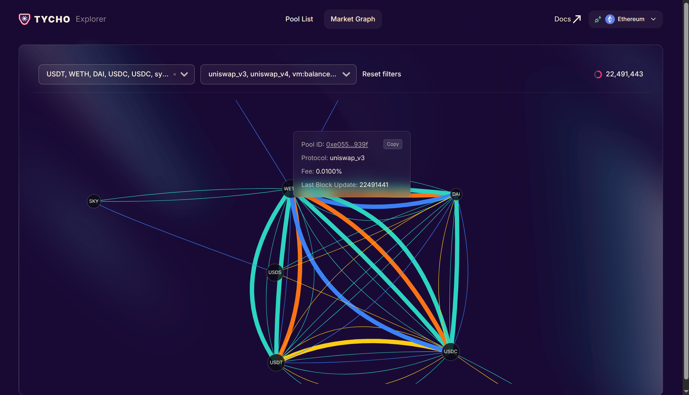

# Pool Explorer



Pool Explorer is a local user interface designed to explore Decentralized Exchange (DEX) pools. It provides low-latency access to comprehensive and trustlessly reliable data, making on-chain liquidity easy to observe and explore. With Pool Explorer, you can filter for specific pools and visually explore the entire set of DEX pools, enabling better decision-making for traders, DEXs, and protocols.

# Quick Start with Docker (Recommended)

The easiest way to run Pool Explorer with multi-chain support is using Docker Compose. This will set up:
- 3 Tycho API instances (Ethereum, Base, Unichain)
- 1 Pool Explorer frontend that can switch between chains

## Prerequisites

- Docker and Docker Compose installed
- Git

## Setup Instructions

1. **Clone the repository and navigate to the workspace**:
```bash
cd /user/a/ws  # Or your preferred workspace directory
```

2. **Configure environment variables**:
Create a `.env` file in the workspace root with the following content:
```env
# Tycho API Configuration
TYCHO_API_KEY=sampletoken
TYCHO_ETHEREUM_URL=tycho-beta.propellerheads.xyz
TYCHO_BASE_URL=tycho-base-beta.propellerheads.xyz
TYCHO_UNICHAIN_URL=tycho-unichain-beta.propellerheads.xyz

# RPC URLs (replace YOUR_KEY with actual API keys for Base and Unichain)
RPC_URL_ETHEREUM=https://eth-mainnet.g.alchemy.com/v2/YOUR_KEY
RPC_URL_BASE=https://base-mainnet.g.alchemy.com/v2/YOUR_KEY
RPC_URL_UNICHAIN=https://unichain.g.alchemy.com/v2/YOUR_KEY

# Logging
RUST_LOG=info,tower_http=debug

# Frontend WebSocket URLs (for browser access - use localhost with exposed ports)
VITE_WEBSOCKET_URL_ETHEREUM=ws://localhost:3001/ws
VITE_WEBSOCKET_URL_BASE=ws://localhost:3002/ws
VITE_WEBSOCKET_URL_UNICHAIN=ws://localhost:3003/ws
VITE_WEBSOCKET_URL=ws://localhost:3001/ws
```

3. **Build and start all services**:
```bash
docker compose build
docker compose up
```

4. **Access the application**:
- Frontend: http://localhost:8080
- Ethereum API: http://localhost:3001
- Base API: http://localhost:3002
- Unichain API: http://localhost:3003

5. **Switch between chains**:
- Use the chain selector dropdown in the WebSocket Connection panel
- The app will automatically clear data and connect to the selected chain

## Docker Commands

```bash
# Start all services in detached mode
docker compose up -d

# View logs for all services
docker compose logs -f

# View logs for specific service
docker compose logs -f tycho-api-ethereum
docker compose logs -f swift-price-oracle

# Stop all services
docker compose down

# Rebuild after code changes
docker compose build
docker compose up
```

# Manual Setup (Alternative)

If you prefer to run without Docker:

## Prerequisites

* Install bun: https://bun.sh/docs/installation
* Install Rust: https://www.rust-lang.org/tools/install
* Clone tycho-api: https://github.com/carloszanella/tycho-api

## Running Tycho API instances

Run three separate instances for each chain:

```bash
# Terminal 1 - Ethereum
cd tycho-api
cargo run -- --tvl-threshold 30 --chain ethereum --port 3001

# Terminal 2 - Base
cd tycho-api
cargo run -- --tvl-threshold 30 --chain base --port 3002

# Terminal 3 - Unichain
cd tycho-api
cargo run -- --tvl-threshold 30 --chain unichain --port 3003
```

## Running Pool Explorer

```bash
# Install dependencies
bun install

# Configure environment variables in .env
VITE_WEBSOCKET_URL_ETHEREUM=ws://localhost:3001/ws
VITE_WEBSOCKET_URL_BASE=ws://localhost:3002/ws
VITE_WEBSOCKET_URL_UNICHAIN=ws://localhost:3003/ws

# Development mode
bun run dev

# Or build and run production
bun run build
bun run preview
```

# Features

- **Multi-Chain Support**: Switch between Ethereum, Base, and Unichain
- **Real-time Updates**: WebSocket connection for live pool data
- **Mobile Friendly**: Fully responsive design for mobile browsers
- **Pool Filtering**: Filter by tokens, protocols, and pool IDs
- **Graph Visualization**: Interactive network graph of liquidity pools
- **Swap Simulation**: Simulate trades on selected pools

# Environment Variables

Configure in `.env` file:

- `VITE_WEBSOCKET_URL`: Default WebSocket URL
- `VITE_WEBSOCKET_URL_ETHEREUM`: Ethereum chain WebSocket URL
- `VITE_WEBSOCKET_URL_BASE`: Base chain WebSocket URL
- `VITE_WEBSOCKET_URL_UNICHAIN`: Unichain WebSocket URL

# Logo Loading

The app uses Coingecko's **free and public** APIs to load token logos. No API key required. Logos are loaded progressively and cached in your browser.

